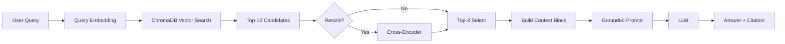

# Architecture — RAG Pipeline (Day 08 Lab)

> Template: Điền vào các mục này khi hoàn thành từng sprint.
> Deliverable của Documentation Owner.

## 1. Tổng quan kiến trúc

```
[Raw Docs]
    ↓
[index.py: Preprocess → Chunk → Embed → Store]
    ↓
[ChromaDB Vector Store]
    ↓
[rag_answer.py: Query → Retrieve → Rerank → Generate]
    ↓
[Grounded Answer + Citation]
```

**Mô tả ngắn gọn:**
Nhóm xây dựng hệ thống RAG nội bộ để trả lời câu hỏi chính sách, SLA, quy trình cấp quyền và FAQ
cho khối CS + IT Helpdesk. Pipeline lấy bằng chứng từ tài liệu nội bộ, trích dẫn nguồn rõ ràng,
và ưu tiên trả lời grounded để giảm hallucination.

---

## 2. Indexing Pipeline (Sprint 1)

### Tài liệu được index
| File | Nguồn | Department | Số chunk |
|------|-------|-----------|---------|
| `policy_refund_v4.txt` | policy/refund-v4.pdf | CS | 6 |
| `sla_p1_2026.txt` | support/sla-p1-2026.pdf | IT | 11 |
| `access_control_sop.txt` | it/access-control-sop.md | IT Security | 7 |
| `it_helpdesk_faq.txt` | support/helpdesk-faq.md | IT | 6 |
| `hr_leave_policy.txt` | hr/leave-policy-2026.pdf | HR | 5 |

> NOTE: `results/` không chứa log index chi tiết theo file tại thời điểm chấm.
> Bảng số chunk ở trên đang là giá trị thiết kế/ước lượng của nhóm, chưa có bằng chứng runtime đính kèm.


### Quyết định chunking
| Tham số | Giá trị | Lý do |
|---------|---------|-------|
| Chunk size | 400 tokens (ước lượng) | Cân bằng độ dài đoạn và khả năng recall |
| Overlap | 80 tokens | Giữ ngữ cảnh giữa các chunk liền kề |
| Chunking strategy | Heading-based + paragraph-based | Ưu tiên ranh giới tự nhiên theo section/paragraph |
| Metadata fields | source, section, effective_date, department, access | Phục vụ filter, freshness, citation |

### Embedding model
- **Model**: OpenAI `text-embedding-3-small`
- **Vector store**: ChromaDB (PersistentClient)
- **Similarity metric**: Cosine
> NOTE: `results/` không lưu metadata về phiên bản embedding model thực chạy. Giá trị trên được lấy theo code/config hiện tại.

---

## 3. Retrieval Pipeline (Sprint 2 + 3)

### Baseline (Sprint 2)
| Tham số | Giá trị |
|---------|---------|
| Strategy | Dense (embedding similarity) |
| Top-k search | 10 |
| Top-k select | 3 |
| Rerank | Không |
| Label kết quả | `baseline_dense` |

### Variant (Sprint 3)
| Tham số | Giá trị | Thay đổi so với baseline |
|---------|---------|------------------------|
| Strategy | Hybrid (dense + sparse/BM25) | Thay dense bằng hybrid |
| Top-k search | 10 | Giữ nguyên |
| Top-k select | 3 | Giữ nguyên |
| Rerank | Không | Giữ nguyên |
| Query transform | Không | Không dùng |
| Label kết quả | `variant_hybrid` | Đổi retrieval mode |

**Lý do chọn variant này:**
Chọn hybrid vì corpus có cả câu tự nhiên (policy) và tên riêng/mã lỗi/thuật ngữ
(SLA ticket P1, ERR-403, Approval Matrix), dense dễ bỏ lỡ keyword/alias.

**Kết quả A/B từ `results/`:**
| Metric | Baseline | Variant | Delta |
|--------|----------|---------|-------|
| Faithfulness | 4.20/5 | 4.50/5 | +0.30 |
| Answer Relevance | 4.60/5 | 4.60/5 | +0.00 |
| Context Recall | 5.00/5 | 5.00/5 | +0.00 |
| Completeness | 3.80/5 | 3.80/5 | +0.00 |

Nhận xét nhanh:
- Hybrid cải thiện rõ nhất ở `qg05` (Access Control) về Faithfulness: 2 → 5.
- Hai cấu hình đều yếu ở `qg07` (Insufficient Context): Faithfulness/Relevance/Completeness = 1.

---

## 4. Generation (Sprint 2)

### Grounded Prompt Template
```
Answer only from the retrieved context below.
If the context is insufficient, say you do not know.
Cite the source field when possible.
Keep your answer short, clear, and factual.

Question: {query}

Context:
[1] {source} | {section} | score={score}
{chunk_text}

[2] ...

Answer:
```

### LLM Configuration
| Tham số | Giá trị |
|---------|---------|
| Model | `gpt-4o-mini` (qua biến `LLM_MODEL`) |
| Temperature | 0 (để output ổn định cho eval) |
| Max tokens | 512 |
> NOTE: `results/` không log model/temperature/max_tokens theo từng run.
> Bảng này đang phản ánh cấu hình code mặc định, chưa phải bằng chứng thực thi.

---

## 5. Failure Mode Checklist

> Dùng khi debug — kiểm tra lần lượt: index → retrieval → generation

| Failure Mode | Triệu chứng | Cách kiểm tra |
|-------------|-------------|---------------|
| Index lỗi | Retrieve về docs cũ / sai version | `inspect_metadata_coverage()` trong index.py |
| Chunking tệ | Chunk cắt giữa điều khoản | `list_chunks()` và đọc text preview |
| Retrieval lỗi | Không tìm được expected source | `score_context_recall()` trong eval.py |
| Generation lỗi | Answer không grounded / bịa | `score_faithfulness()` trong eval.py |
| Token overload | Context quá dài → lost in the middle | Kiểm tra độ dài context_block |

---

## 6. Evaluation Snapshot (từ `results/`)

**Nguồn số liệu:**
- `results/scorecard_baseline.md` (Generated: 2026-04-13 17:28)
- `results/scorecard_variant.md` (Generated: 2026-04-13 17:29)
- `results/ab_comparison.csv`

> NOTE: Bộ kết quả hiện tại dùng ID `qg01..qg10` (grading questions), không phải `q01..q10` (test questions mẫu).

**Các câu có điểm thấp/cần ưu tiên cải thiện:**
- `qg07` (Insufficient Context): cả baseline và variant đều trả lời quá ngắn ("Tôi không biết"), thiếu giải thích grounded theo tài liệu.
- `qg01`, `qg02`: completeness chỉ 3/5 do thiếu một số chi tiết phụ (version/effective date, tính bắt buộc VPN và tên phần mềm).

**Điểm mạnh hiện tại:**
- Context Recall đạt 5.00/5 cho cả baseline và variant (không tính câu không có expected source).
- Nhóm câu Refund (`qg03`, `qg04`, `qg10`) có faithfulness ổn định 5/5.

---

## 7. Diagram (tùy chọn)

Sơ đồ pipeline (Mermaid):


